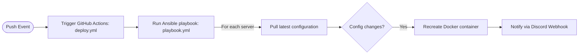

export const metadata = {
  "title": "The Home Node_build_005 - Automation with Ansible, Docker CI/CD with GitHub Actions",
  "publishedAt": "2025-03-31",
  "summary": "Implementing comprehensive automation using Ansible for server administration and Docker CI/CD pipeline with GitHub Actions for streamlined container management and deployment."
}

Tags: [[The Home Node 🏡🖥️🗄️ (DevLog)]]

# Build 005: Automation with Ansible, Docker CI/CD with GitHub Actions

March 31, 2025

## Changelog

- Created a centralized GitHub Docker configuration repository
- Implement Ansible server administration automation
- Implement Ansible docker update automation
- Deploy Semaphore UI
- Deploy What's Up Docker
- Deploy Scrutiny + InfluxDB

## Automation

For this build, I want to automate of the server administration tasks that I do. In particular I have two main tasks that I do very often. The first one is the updating the system packages like running `{sh icon} $ sudo apt update && sudo apt upgrade -y`. Usually every time you SSH into the server, it informs you that updates are available so you can perform a system upgrade. But there are times where you wouldn't log in into your server for a few days or maybe even a week if nothing needs fixing. So in this case, I would have to make sure I log in into my servers to keep them up to date. It would be nice if we can automate this task. 🙏

The second task is updating my Docker containers. I deploy my Docker containers using Docker Compose, so I only have to update my YAML files and recreate the containers whenever I make a change. This is fine at the start when you are learning more about deploying containerized applications and only need to manage a few configuration files. But it becomes a mess when you have to manage lots of docker compose files across multiple machines. Especially if you want to deploy the same application to multiple servers, how do you ensure their configurations are all up to date?

Currently, I keep a master copy of all my configs in my development machine then copy and paste this config to my servers, then I would have to manually recreate the Docker container. This is a simple task but it gets very tedious as the number of applications scale. Moreover, I plan to pin my containers to a specific version number like `v3.0.2` instead of using the `latest` tag, then manually updating the version number to update the containers, as the best practices suggest. In this way, I can test if the new updates would cause problems, instead of me figuring out what went wrong if I just rely on automatic updating like using Watchtower. So it would be nice if I can somehow consolidate all my configs into one source of truth then have my servers pull the updated configs and recreate the containers if needed. Essentially, automating the entire Docker update process. 🚀

### Ansible

To handle my automation needs, I decided to use a very powerful and versatile automation platform called [Ansible](https://ansible.com). Ansible is an open-source automation software that is able to automate virtually any task. This is developed Red Hat, the leading developer in the Enterprise Linux space, so we can expect Linux is a first class citizen. Ansible allows managing your remote machines as Infrastructure as Code (IaC), which means you simply define the desired state of the system and Ansible does all of the steps internally to follow the desired state. No need for the usual scripting, where you code step by step to automate tasks.

Ansible uses an **agentless architecture** where agent software doesn't have to be installed for every machine you want to automate. You only install Ansible on your main machine (control node). Ansible uses YAML configuration syntax; making it very easy to configure. Lastly, Ansible is Idempotent, which means applying the same change to the system state does not change the system further. So you wouldn't get any unexpected behaviors from running the same automation over and over again.

**Ansible Architecture**

![[build 005 ansible architecture.png|400]]

The Ansible architecture contains two types of nodes: Control node and Managed nodes. The control node contains the Ansible program and Ansible configuration. It contains the **Inventory** file, which contains a list of the managed nodes. While, the managed nodes are the machines you want to manage or automate. These are connected using SSH where automation commands are executed to match the desired configuration state.

### CI/CD Pipeline

Ansible is very powerful and it can allow me to automate updating my servers and my Docker containers. But I want to introduce a software development practice that DevOps (Development Operations) people use to automate their tasks, which will elevate my automation to another level.

Software development involves some tedious and repetitive tasks like testing, building, and deploying, which are performed for every software version they develop. To allow faster development cycles and thus more time spent of software development itself, they needed to automate these mundane and repetitive parts of software development. This is where the CI/CD paradigm emerged. This consists of two parts Continuous Integration (CI) and Continuous Delivery/Deployment (CD).

**Continuous Integration (CI)**
Modern software development involves the use of a central repository with version control where every change is in the form of a _commit_. For big teams with a large codebase, developers would have to submit a pull request for their work, then repository maintainers will check their work and perform some testing before integrating this into the codebase. Every commit needs to be reviewed and checked before it gets integrated to the codebase. If this doesn't get automated then this would cause massive slowdowns in the early stages of the software development cycle.

Continuous Integration (CI) allows modern software development to be agile by automating building, testing and integration for every code change. This allows developers to make changes more frequently and streamline the software development process so they can focus on more productive work. The automated testing ensures that central repository is always working and able to point out bugs immediately after the commit.

**Continuous Delivery/Deployment (CD)**
The Continuous Delivery (CD) extends the CI for the later stages of the software development where it prepares to finalize the codebase by doing extensive testing and validation before being delivered for production. This involves taking the output of the CI and testing this is a production-like environment where it goes through more rigorous testing along with user testing, and all the final validation before it gets deployed to production.

The Continuous Deployment (CD) extends Continuous Delivery by automatically deploying the software to production after performing the automated tests. This allows to deliver updates to the end user quicker but can risk more bugs in production if tests are not extensive enough.

### Docker Automation Workflow

![[Build 005 Docker automation workflow.png]]

In my case, I take parts of this CI/CD pipeline to my Docker automation workflow. Here, I also take advantage of a centralized repository containing the source of truth for all my docker configuration files. To make changes on my remote machines, I would need to make edits by `git commit` and `git push` this to the remote repository. This then triggers the automation pipeline, detailed below, which updates the relevant containers and sends a status notification to a Discord Webhook. This Discord Webhook sends a message to my Discord server containing information about the updated containers.

On the right side of the workflow, I have a service called **What's Up Docker** that regularly checks the Docker containers for updates. This too will send a Discord Webhook to notify me when I need to update my Docker containers. So this entirely Docker automation workflow revolves around the manual event where I push updates to the centralized remote repository. This then sets off a chain of automated actions that allows the manage the deployment of my Docker containers, some sort of a Continuous Deployment (CD) setup.

Currently, my automation workflow lacks the Continuous Integration (CI) part where it should test the updated config for errors. This could be as simple as a configuration linter, but I could also test the Docker applications in an isolated environment. But right now, this is quite overkill. I'm fine with manually checking if my updated services are running normally, if not then it's easy revert back to the previous configuration due do version control. Also, I am using status monitoring service called **Uptime Kuma** that would notify me on Discord, similar to the ones above, whenever a service goes down so I think this is not much of a hassle.

**Automation Pipeline**



This is the flowchart that goes into detail how the automation pipeline allows to update the Docker containers from the updated configuration. This, of course, starts with a push event that triggers a GitHub Action defined in `deploy.yml`. This is directly integrated with the GitHub repository so it automatically performs the event listening capabilities. This GitHub Action then will run a task that runs an Ansible playbook defined in `playbook.yml`, which contains the actual automation for the managed nodes.

For each of the managed nodes, it then pulls the latest configuration and then will check if the Docker configuration file `docker-compose.yml` changes. If this changes, it will recreate the Docker container using the updated configuration then sends a notification via a Discord Webhook. If no changes occur, then it is essentially skipped so the currently running services are untouched. So in effect, this automatically updates the Docker containers that I make configuration changes to. ✨

Note that I haven't included the functionality to remove containers, if I specify. It only ensures a container with the latest configuration exists, so if this doesn't exists, it creates it; and if this is not updated, then it gets recreated. For now, I want to test this automation setup. I can simply add the functionality of removing containers later on if I need it. Also, I rarely have a need to remove containers because I want containers to be always running on the machine I specify. I don't need to move containers around like in a high-availability setup because I don't have multiple machines for it. If I do want to get into high-availability, I would probably use Kubernetes instead of this custom automation pipeline. I found that Docker Compose is better if you want to specify which machine you want to service to run from, but Kubernetes/Docker Swarm is better if you give this control to the Orchestration platform.

**GitHub Actions**
[GitHub Actions](https://github.com/features/actions) allows CI/CD automation tool that natively works with GitHub repositories. It allows you to trigger workflows from events like push and pull requests. It allows you to create a consistent isolated environment to run your automated tests, builds, and deployment. These workflows get executed on an isolated environment called a GitHub runner, that can run on the cloud using GitHub servers or self-hosted.

**What's Up Docker**
[What's Up Docker](https://getwud.github.io/wud/#/) (WUD) is a simple application that checks your Dockers containers for new updates and sends you a notification. It supports various notification services like Slack, Discord, Telegram, Gotify, Email, and others.

## Configuration

### Ansible

Ansible is agentless, so you only need to install this on the control node machine.

There are two requirements you must consider to run Ansible:

1. Ansible requires a UNIX-like machine with Python installed. (Linux, MacOS and Windows with WSL)
2. The managed node needs to be accessible from the control node via SSH.

**Prerequisite: SSH keys**
Ansible uses SSH to communicate with remote hosts. If you already have setup SSH to your remote servers, then you can head to the next section. But if you are still using password authentication with SSH, I recommend setting up SSH keys for your server communication.

On you control node machine (your main computer), create an SSH key using the `ssh-keygen` command. The `-t` specifies the type of key and `-C` is just a comment to easily differentiate the owner of the key.

```sh
$ ssh-keygen -t ed25519 -C "main machine"
Generating public/private ed25519 key pair.
Enter file in which to save the key (/home/user/.ssh/id_ed25519):
Enter passphrase for "/home/user/.ssh/id_ed25519" (empty for no passphrase):
Enter same passphrase again:
Your identification has been saved in /home/user/.ssh/id_ed25519
Your public key has been saved in /home/user/.ssh/id_ed25519.pub
The key fingerprint is:
SHA256:63lKiLRm2amMW//gD7QDB9pVBxibMOLMBbbG5z8ZKGw main machine
The key's randomart image is:
+--[ED25519 256]--+
|  +.+ .oo..      |
| * + o.+ .       |
|  B o +          |
| o = +           |
|  E * + S        |
| . o X * .       |
|    B % o        |
|   * + B ..      |
|  o.o oo*o       |
+----[SHA256]-----+'

```

This create a public `id_ed25519.pub` and private `id_ed25519` key pair. The public key is distributed to authorized machines that use this key to encrypt data sent to you and the private key is used to decrypt this data. It is important to keep your private key secure. **This should never leave your machine**, so be careful with this. Next, we send the newly generated public key to the server. We use the `ssh-copy-id` to make this happen.

```sh
$ ssh-copy-id -i id_ed25519.pub nicserver@192.168.8.10
/usr/bin/ssh-copy-id: INFO: Source of key(s) to be installed: "id_ed25519.pub"
/usr/bin/ssh-copy-id: INFO: attempting to log in with the new key(s), to filter out any that are already installed
/usr/bin/ssh-copy-id: INFO: 1 key(s) remain to be installed -- if you are prompted now it is to install the new keys

Number of key(s) added: 1

Now try logging into the machine, with: "ssh -i ./id_ed25519 'nicserver@192.168.8.10'"
and check to make sure that only the key(s) you wanted were added.
```

Try to connecting to your server using SSH and you should immediately be connected without being asked a password! 🔒

> Make sure all servers have the public SSH key so Ansible can connect to them.

**Installing Ansible**
Ansible can be installed via the Python's pip like so.

```sh
$ pip install ansible
# Alternatively, use pipx if pip is not available
$ pipx install ansible
```

You can also install directly from your distribution's repositories, check relevant instructions [here](https://docs.ansible.com/ansible/latest/installation_guide/installation_distros.html).

**Creating Ansible Inventories**
Inventories contain a list of the managed hosts, which are the remote machine you want to run your automation on. The inventory file can be in INI or YAML format. The INI configuration is easier for small number of nodes as you just create a group and add the IP addresses or FQDNs of the hosts. The YAML format is useful for larger deployments where you have more control on labeling the groups.

```ini title:inventory.ini
[myhosts]
192.168.8.10
192.168.8.11
server.domain.tld
```

```yml title:inventory.yml
myhosts:
  hosts:
    my_host_01:
      ansible_host: 192.168.8.10
    my_host_02:
      ansible_host: 192.168.8.11
    my_host_03:
      ansible_host: server.domain.tld
```

You can try pinging your managed hosts using the `inventory.ini` file with`{sh icon} $ ansible -m ping`.

```sh
$ ansible -m ping -i inventory.ini
192.168.8.10 | SUCCESS => {
    "ansible_facts": {
        "discovered_interpreter_python": "/usr/bin/python3.12"
    },
    "changed": false,
    "ping": "pong"
}
192.168.8.11 | SUCCESS => {
    "ansible_facts": {
        "discovered_interpreter_python": "/usr/bin/python3.12"
    },
    "changed": false,
    "ping": "pong"
}
```

**Creating an Ansible Playbook**
Playbooks are YAML configuration files that contain the desired state of the managed hosts. Here are some terms that Ansible uses:

- Playbook - This is a list of plays that is performed sequentially.
- Play - This is a list of tasks that applies to a group of managed hosts.
- Task - The action to be executed on the target machines. This uses modules to execute the tasks.
- Module - The actual code the executed on the target machines. These are predefined scripts and executed binaries that performs the system actions.

This is a basic playbook where we define a play `My first play` to be executed on the `myhosts` group in the inventory. It runs two tasks: `Ping my hosts` uses the `ansible.builtin.ping` module to ping the hosts, and `Print message` uses the `ansible.builtin.debug` module to send a debug message back the control node.

```yml title:playbook.yml
- name: My first play
  hosts: myhosts # Play applies to this group of hosts
  tasks:
    - name: Ping my hosts # Task to be run
      ansible.builtin.ping: # Module to be used

    - name: Print message
      ansible.builtin.debug:
        msg: Hello world
```

We can run this playbook using the `{sh icon} $ ansible-playbook` command.

```sh
$ ansible-playbook -i inventory.ini playbook.yml
PLAY [My first play] **********************************************************

TASK [Gathering Facts] ********************************************************
ok: [192.168.8.11]
ok: [192.168.8.10]

TASK [Ping my hosts] **********************************************************
ok: [192.168.8.11]
ok: [192.168.8.10]

TASK [Print message] **********************************************************
ok: [192.168.8.10] => {
    "msg": "Hello world"
}
ok: [192.168.8.11] => {
    "msg": "Hello world"
}

PLAY RECAP ********************************************************************
192.168.8.10: ok=3  changed=0  unreachable=0  failed=0  skipped=0  rescued=0  ignored=0
192.168.8.11: ok=3  changed=0  unreachable=0  failed=0  skipped=0  rescued=0  ignored=0
```

From the result, we can see it executes the tasks that we defined in the playbook and we can see a summary of the actions in the `PLAY RECAP` section. We can also see that it runs a `Gathering Facts` task first before executing our tasks. This is always run by default so it can gather information on what commands it can run on the target system before execution.

#### Update Servers Playbook

Now let's create an Ansible playbook that will automate updating the system packages on your remote servers. This can be easily done using the `ansible.builtin.apt` module. You just have to specify some parameters to `upgrade: true` (apt upgrade) and `update_cache: true` (apt update). Ansible has lots of predefined modules that allow you to easily any automation task out there, even community made ones. So you can expect Ansible to cater to all your automation needs.

```yml title:apt-update.yml
- name: Update Servers
  hosts: myhosts
  become: true
  tasks:
    - name: Apt-update
      ansible.builtin.apt:
        upgrade: true
        update_cache: true
```

Run with `{sh icon} $ ansible-playbook -K`, where `-K` is short for `--ask-become-pass` which asks you for the become (sudo) password for you machines. In my case, my sudo password is same for testing.

```sh
$ ansible-playbook -K -i inventory.ini apt-update.yml
BECOME password:

PLAY [Update Servers] *****************************************************

TASK [Gathering Facts] ****************************************************
ok: [192.168.8.11]
ok: [192.168.8.10]

TASK [Apt-update] *********************************************************
changed: [192.168.8.11]
changed: [192.168.8.10]

PLAY RECAP ****************************************************************
192.168.8.10  : ok=2  changed=1  unreachable=0  failed=0  skipped=0  rescued=0  ignored=0
192.168.8.11  : ok=2  changed=1  unreachable=0  failed=0  skipped=0  rescued=0  ignored=0
```

There we go, we have updated our servers with the one command! The status `changed=1` means it performed changes to the system, a system upgrade in this case. Otherwise it will return `changed=0`, because it does not make further changes if the desired state is already reached, Idempotency.

### Semaphore UI

[Semaphore UI](https://semaphoreui.com/) provides a frontend UI for Ansible as well as other automation platforms like Terraform and OpenTofu. It recently added support for scripting with Bash, Powershell, and Python. This makes running automation and scripts very easy as you can run everything with a click of a button. It even works from your phone, so you don't have to pull out your laptop during a quick server update. Actually, you can even setup a cron job so it can run your automation on a schedule. This is truly an amazing quality of life application. 😍

In my setup, I chose to deploy Semaphore UI on one of my servers. But I also need to manage this server using Ansible, so I would end up using Ansible to connect to itself using SSH. Just take note of this quirk if you have the same setup. You would need to add yourself to the `authorized_hosts`, or try to SSH to this same machine to add this automatically.

```yml title:docker-compose.yml
services:
  semaphore:
    image: semaphoreui/semaphore:v2.13.7
    container_name: semaphore
    networks:
      - caddy-net
    volumes:
	  - /etc/localtime:/etc/localtime:ro
      - semaphore_data:/var/lib/semaphore
      - semaphore_config:/etc/semaphore
      - semaphore_tmp:/tmp/semaphore
    environment:
      - SEMAPHORE_DB_DIALECT=bolt
      - SEMAPHORE_ADMIN=${SEMAPHORE_ADMIN}
      - SEMAPHORE_ADMIN_PASSWORD=${SEMAPHORE_PASSWORD}
      - SEMAPHORE_ADMIN_NAME=${SEMAPHORE_NAME}
      - SEMAPHORE_ADMIN_EMAIL=${SEMAPHORE_EMAIL}

volumes:
  semaphore_data:
  semaphore_config:
  semaphore_tmp:

networks:
  caddy-net:
    external: true
```

After deploying, you should see a login screen like this where you sign in with your provided credentials.

![[semaphore login.png]]

You will be asked to create a new project at the beginning. A project is self-contained collection of automation scripts and tools for a certain application. So you can create a project for your home servers then a separate project for your remote machines, but this is more useful in for larger teams where certain people gets to access certain projects. Let's create a `Demo Project` for now.

![[semaphore demo project.png]]

In the `Task Templates` section, you can see the demo tasks where it contains the Ansible playbooks, OpenTofu, Bash, Powershell scripts, etc. as Tasks. The play button executes these tasks.

![[Semaphore Task Templates Demo.png]]

Go ahead and run the `Ping semaphoreui.com` Ansible playbook, and observer the logs.

![[semaphore ping ansible test.png|600]]

**Repositories**
All the files like Ansible Playbooks, Terraform/OpenTofu configuration files, and scripts are pulled from a repository. All the demo files earlier were pulled from this GitHub repository. Then tasks are created that point to which file it should run from.

![[semphore demo repository.png]]

For this demonstration, I will create a GitHub repository containing my update servers playbook earlier. If you have no experience with creating GitHub repositories then check out GitHub's [quickstart guide](https://docs.github.com/en/repositories/creating-and-managing-repositories/quickstart-for-repositories) for creating repositories. There are lots of resources online for this so I'll not include the basics of git repositories. Once you have a link to your repository, you may continue on the section.

```txt title:"Repository File Structure"
homelab-automations/
└── ansible/
    ├── inventory.ini
    └── apt-update.yml
```

Assuming you now have your GitHub repository with the update servers playbook, let's create a new project.

![[semaphore new project.png|400]]

Next, we add your repository link to the `Repositories` section. If your repository is private then we also need to add the repository credentials in `Key Store` section. You can either put your SSH key or use password login. I recommend using SSH with GitHub, for more information on this check out this GitHub [guide](https://docs.github.com/en/authentication/connecting-to-github-with-ssh/adding-a-new-ssh-key-to-your-github-account).

![[semaphore add ssh key.png]]

After this we can add the GitHub repository in the `Repositories` section. Paste your URL and select the access key if applicable. Make sure to use the slash syntax as in `ssh://git@github.com/InterstellarMist/homelab-automations.git`.

![[semaphore add repo.png]]

**Creating an Inventory**
We can import our Ansible inventory `inventory.ini` in the `Invetory` section. Here you specify the user credentials. In my case, I use the same SSH key as earlier to connect to my servers. Also, I created a sudo password in the `Key Store` so I don't have to type it during task execution.

![[semaphore import invetory.png]]

**Creating a Task**
Now, we have reached the meat of this setup. Let's create a task that uses the `apt-update.yml` playbook we used earlier. There are three types of Task templates: Tasks for normal playbooks, Build for tasks that create artifacts and Deploy for deploying artifacts to destination servers. Most of the time, we only need to use the Normal Task, the others are more useful in software development.

Simply specify the path to the playbook file, inventory, and repository.

![[semphore create task ansible.png]]

I was facing some issues with the ssh connection authentication so i had to add the the username `ansible_user` to the inventory file. I also changed to a YAML format because I found it convenient and suppressed the python auto discovery warning that pops up every Ansible run. Make sure to change the inventory in Semaphore from `inventory.ini->inventory.yml`.

```yml title:inventory.yml
homelab:
  vars:
    ansible_python_interpreter: auto_silent
  hosts:
    nicserver:
      ansible_host: 192.168.8.10
      ansible_user: nicserver
    hpserver:
      ansible_host: 192.168.8.11
      ansible_user: hpserver
```

Also make sure to update the `hosts` in the playbook, if you changed that too.

```yml title:apt-update.yml hl:hosts
- name: Update Servers
  hosts: homelab
  become: true
  tasks:
    - name: Apt-update
      ansible.builtin.apt:
        upgrade: yes
        update_cache: true
```

If we now run the tasks using the play button... 🥁🥁🥁
--- start-multi-column:

```column-settings
Number of Columns: 2
Column Size: [49%,49%]
Border: off
Shadow: off
```

![[semaphore apt update result 1.png]]

--- column-break ---

![[semaphore apt update result 2.png]]

--- end-multi-column
It works!!! Now we can successfully update our server with one click right from the browser. 🚀

**Scheduled Tasks**
We can also set the update servers Ansible playbook to run on a schedule, say everyday at a certain time. In this way everything is automated, you don't even have to manually click the button to update the servers. 💯💯💯

![[semaphore scheduled tasks.png]]

**How does Semaphore work?**
If you are curious at what Semaphore is doing under the hood. Notice that at the start of the logs, it it queues the task for a runner to execute. In our case, the tasks run in the same server but Semaphore can be configured to have multiple different runners on different machines that can run tasks in parallel. This is actually the process used in CI/CD pipelines where dedicated runners can compile code, perform tests, build applications and deploy in parallel. This is useful when you have to build your application for different operating systems like Windows, MacOS, Linux, Android, IOS, etc. If we were to run this in a single server you would need to wait for the current task to finish before starting the next.

Next, notice how it clones the repository during the start of the task. This allows you to follow a sort of _GitOps_ (git operations) approach where your one source of truth is the repository. So if you want to make changes, you push updates to the repository, then the runners will receive all updates because they always clone the repo at the start of each task. After cloning then it can now use the Ansible playbook in the repo to perform the configured Ansible Tasks.

**[Bonus] Server Update Discord Webhook**
The last piece of the puzzle is getting notified about the results of the automation task. We can simply add another Ansible task after the apt update to send a [Discord Webhook](https://support.discord.com/hc/en-us/articles/228383668-Intro-to-Webhooks) based from the output of the update task. As shown below, we add the `Send Discord notifcation` task as a handler. This only gets executed when the output of the parent task has changed. We put the `nofity` parameter to specify to call the handler on change. The `register` parameter saves the output to the variable `update_output` then we extract information from this using a jinja2 template syntax `{{ variable }}` in the Discord embed.

```yml title:apt-update.yml
- name: Update Servers
  hosts: homelab
  gather_facts: false
  become: true
  tasks:
    - name: Apt-update
      ansible.builtin.apt:
        upgrade: true
        update_cache: true
      register: update_output
      notify: Send Discord notification

  handlers:
    - name: Send Discord notification
      community.general.discord:
        webhook_id: <your-webhook-id>
        webhook_token: <your-webhook-token>
        embeds:
          - title: 🗄️ **Server Update Notification**
            color: "{{ 3066993 if not update_output.failed else 15158332 }}" # Green-success, Red-Failed
            fields:
              - name: "🖥️ Host"
                value: "{{ inventory_hostname }}"
                inline: true
              - name: "❓ Status"
                value: "{{ 'Success' if not update_output.failed else 'Failed' }}"
                inline: true
              - name: "📜 Result"
                value: "{{ update_output.msg }}"
                inline: false
```

Webhooks allows to push data to a web application, usually to trigger some event. Specially, it is an API call on a specific endpoint where you send a PUT HTTP request. To create a Discord Webhook, click on `edit channel` on your chosen channel in your Discord server, then go to `Integrations>Webhooks` and click `New Webhook`. Change the Webhook name and icon as you like and copy the Webhook URL.

![[discord webhook create.png|500]]
From this Webhook URL, the format is `https://discordapp.com/api/webhooks/webhookid/token`, simply extract the ID and the token and put this in the Ansible task. Once your server performs a scheduled update and something has been updated, then you should see get a notification like this. ✨

![[discord update webhook.png]]

### Docker Config Automation

Now we have a sense of how Ansible works, let's head on to the Docker update workflow automation I detailed at the start. Recall that we need a centralized Docker configuration repository that serves as our source of truth. Then upon pushing updates to this repository, it triggers a GitHub action that runs an Ansible playbook. This Ansible playbook contains the Docker automation tasks itself, then sends a Discord Webhook to notify the user on the update status.

#### Docker Configuration Repository

This is file structure of my Docker configuration repository. I created three main folders `ansible`, `.github`, and `docker`. The `ansible/` folder contains the Ansible playbook and inventory, the `.github/` folder contains the GitHub actions configuration file, and the `docker/` folder contains all my docker stacks, even for ones I don't plan to deploy. The docker folder can contain all my docker stacks because I get to specify which stacks should be present on each server, stored in the `inventory.yml`. (more on this later) So, this repository truly becomes my centralized Docker configuration repository, where I get to store and manage all configuration, and deploy specified containers.

```txt title:"Repository File Structure"
docker configuration repo/
├── ansible/
│   ├── inventory.yml
│   └── playbook.yml
├── .github/
│   └── workflows/
│       └── deploy.yml
└── docker/
    ├── stack 1/
    │   └── docker-compose.yml
    ├── stack 2/
    │   ├── docker-compose.yml
    │   └── .env
    ├── ...
    └── stack x/
        ├── config/
        │   └── config.yml
        └── docker-compose.yml
```

> If you are curious on how to generate this fancy file tree check out https://tree.nathanfriend.com!

#### GitHub Actions

GitHub Actions use runners to execute the automation pipeline. GitHub hosted runners are free for public repositories but with [usage limits](https://docs.github.com/en/billing/managing-billing-for-your-products/managing-billing-for-github-actions/about-billing-for-github-actions#included-storage-and-minutes). However, self-hosted runners are completely free (even for private repositories) because the resources are running on your own servers. I prefer to run everything within my local machines because this automation controls machines on my local network, also my configuration files contains sensitive information like API keys, passwords, etc. So we will then deploy a self-hosted GitHub runner for our GitHub Actions automation pipeline.

> Note that your docker configuration repository must be PRIVATE for security reasons. This would prevent public forks from potentially running malicious workflows on your self-hosted runner. Also always ensure you don't leak any credentials when are making your repositories public.

**Adding Self-Hosted Runner to a Repository**
On your GitHub repository page, go to `Settings`.

![[github main page bar.png|700]]

Then `Actions>Runners` and click on `New self-hosted runner`.

![[github add self hosted runner.png]]

Simply follow the relevant instructions provided to install the self-hosted runner.

![[github self hosted runner instructions.png]]

After the setup process, you should now see your runner connected to your repository.

![[Added self hosted runner.png]]

Additionally, we can configure the runner to run as a service so it can automatically start on background at boot. See the commands below to install and start the service.

```sh
$ sudo ./svc.sh install
$ sudo ./svc.sh start
$ sudo ./svc.sh status
$ sudo ./svc.sh stop
$ sudo ./svc.sh uninstall
```

**Workflow Configuration**
To use GitHub Actions, we must create a **workflow** that is configured using a YAML file. This is where you specify the event that triggers the workflow and the jobs that get executed. This configuration file should placed in the `.github/workflows` directory of your repository.

In our case, we will use GitHub Actions to trigger an Ansible playbook on a push event. The configuration is very simple, as shown below.

```yml title:deploy.yml
name: Deploy with Ansible

on:
  push:
    branches:
      - main

jobs:
  deploy:
    runs-on: self-hosted  # The GitHub Runner on your server

    steps:
      - name: Checkout repository
        uses: actions/checkout@v4
		with:
          fetch-depth: 1
          sparse-checkout: "ansible"

      - name: Run Ansible Playbook
        run: |
          ansible-playbook -i ansible/inventory.ini ansible/playbook.yml
```

We first specify to trigger on a pull event on the main branch with `on: push: branches: main`. The specify the `deploy` job that runs on the `self-hosted` runner with two steps. The first step is a standard git checkout that clones the latest version of the repository on the isolated runner instance. We specify to only clone the latest version of the `ansible` directory, to make this process a bit faster. The second step runs the `ansible-playbook` command using the repository's Ansible configuration.

#### Ansible

**Prerequisites**

- Ansible is installed on your server where you are self-hosting the GitHub runner.
- The Ansible managed nodes are accessible from GitHub runner the via SSH, as this will now act as the control node.
- Another requirement is that since we need to clone the private repository from the managed nodes, these nodes must somehow have authorized SSH keys in GitHub. While it is possible to add every node to GitHub, this does not scale well. To help with this, we will use SSH agent forwarding.

**SSH Agent Forwarding**
SSH Agent Forwarding allows for a remote server to use your local SSH key as if it was stored in their system. This makes use of an SSH Agent that forwards your key to a remote server. In our case, I have added the SSH key of the machine running the self-hosted runner on GitHub. As this acts as the Ansible control node, this should already have a secure connection between each managed node, so all we need is to forward the authorized local SSH key to these managed nodes so they can clone the private repository.

To do this, we would have to configure this SSH agent forwarding on the server with the runner. Create a config file `~/.ssh/config` and input this simple configuration, where you replace `example.com` with your server domain or IP address.

```txt title:~/.ssh/config
 Host example.com
   ForwardAgent yes
```

Next we need to add the key to the `ssh-agent`.

```sh
# Start ssh-agent in background
$ eval "$(ssh-agent -s)"
Agent pid 922700

# Add SSH key
$ echo ssh-add ~/path/to/key
Identity added: id_ed25519 (hpserver)

# [OPTIONAL] Auto start ssh-agent at boot
$ echo 'eval "$(ssh-agent -s)"' >> ~/.bashrc
$ echo 'ssh-add -q /path/to/your/private_key' >> ~/.bashrc
```

Let's check if the SSH agent forwarding works.

```sh
# Ensure runner server is authenticated
hpserver@hpserver$ ssh -T git@github.com
Hi InterstellarMist! Youve successfully authenticated, but GitHub does not provide shell access.

hpserver@hpserver$ ssh hpserver@192.168.8.10

# Remote server
nicserver@nicserver$ ssh -T git@github.com
Hi InterstellarMist! Youve successfully authenticated, but GitHub does not provide shell access.
```

If you can SSH to GitHub from the remote server, then the SSH key forwarding works! 🚀

To use SSH agent forwarding we must start the ssh-agent and add the SSH key in the GitHub runner. So now we have the updated configuration. We export the `SSH_AUTH_SOCK` to the `GITHUB_ENV` because the runner actually runs a separate environment from the host system, so it normally wouldn't inherit the ssh-agent process from the environment of the host system.

```yml title:deploy.yml hl:21-23
name: Deploy with Ansible

on:
  push:
    branches:
      - main

jobs:
  deploy:
    runs-on: self-hosted # The GitHub Runner on your server

    steps:
      - name: Checkout repository
        uses: actions/checkout@v4
        with:
          fetch-depth: 1
          sparse-checkout: "ansible"

      - name: Start SSH Agent and Add Key
        run: |
          eval "$(ssh-agent -s)"
          ssh-add ~/.ssh/id_ed25519  # Adjust the key path if needed
          echo "SSH_AUTH_SOCK=$SSH_AUTH_SOCK" >> $GITHUB_ENV

      - name: Run Ansible Playbook
        run: |
          ansible-playbook -i ansible/inventory.yml ansible/playbook.yml
```

**Ansible Configuration**
For the Ansible configuration, we define a playbook and an inventory file, as with the previous runs. In our `inventory.yml` file, this is mostly the same as our inventory file above but we add the variable `docker_stacks`. The `docker_stacks` variable contains a lists of the stacks in the `docker/` repository directory that we want to deploy and update on each server. This allows us to choose which docker stacks to deploy from our centralized repository. You can even deploy the same stack on multiple hosts.

```yml title:inventory.yml
homelab:
  vars:
    ansible_python_interpreter: auto_silent
  hosts:
    nicserver:
      ansible_host: 192.168.8.10
      ansible_user: nicserver
      docker_stacks:
        - nginx1
        - nginx2
    hpserver:
      ansible_host: 192.168.8.11
      ansible_user: hpserver
      docker_stacks:
        - nginx1
        - nginx2
```

For the Ansible playbook, we perform a `git pull` that pulls the latest changes from our remote repository into the `repo_path` directory of our servers. Feel free to change this to your desired location. Next, we loop over the `docker_stacks` to check each stack for configuration changes. The `state: present` creates a Docker container if it is not present, the`pull: missing` pulls new images if it is not available locally, and `recreate: auto` will recreate existing containers if the configuration file has changed. The output of the task gets saved in the `compose_ouput`. Then the `notify` argument will call the specified handler when the the output has the flag `changed: true`, either recreated/created a container. Lastly, we parse the `compose_output` in the handler `Show deployment output on change` to show the summary of the task for debugging.

```yml title:playbook.yml
- name: Deploy Docker Stacks
  hosts: homelab
  vars:
    repo_path: "/home/{{ ansible_facts['nodename'] }}/Test-automation"

  tasks:
    - name: Pull the latest changes
      ansible.builtin.git:
        repo: "git@github.com:InterstellarMist/Test-automation.git"
        dest: "{{ repo_path }}"
        version: main

    - name: Deploy each Docker Compose stack
      community.docker.docker_compose_v2:
        project_src: "{{ repo_path }}/docker/{{ item }}"
        state: "present"
        pull: "missing"
        recreate: "auto"
      loop: "{{ docker_stacks | default([], true) }}"
      register: compose_output
      notify:
        - Show deployment output on change

  handlers:
    - name: Show deployment output on change
      ansible.builtin.debug:
        msg: |
          Deployment status for {{ item.item }}:
          - Changed: {{ item.changed }}
          - Failed: {{ item.failed }}
          - Actions:
            
            * {{ action.what | capitalize }}: {{ action.id }} ({{ action.status }})
            
          - Container: {{ item.containers[0].Name if item.containers else 'N/A' }}
          - Image: {{ item.images[0].Repository }}:{{ item.images[0].Tag }}
          - Ports: {{ pub.URL }}:{{ pub.PublishedPort }}->{{ pub.TargetPort }}/{{ pub.Protocol }} 
      loop: "{{ compose_output.results }}"
      when: item.changed
      loop_control:
        label: "{{ item.item }}"
```

After pushing a commit to the remote repository, we can see the GitHub runner running the Ansible playbook and thus creating our containers. All this from the convenience of our work machine, where we just push changes to the remote repository.

![[github runner test automated deployment.png]]

![[sample automated deployment.png]]

Let's check its actual intended use, updating containers automatically when I change the configuration. Let's say I change some configuration on the `nginx1` stack and decided to change the container name to `nginx1-new`. The typical use case is to update the version numbers of the docker images but this showcase also demonstrates the same behavior, where any change to the docker compose file will lead to container recreation.

![[Automated container update logs.png]]

![[automated update containers.png]]

As we can see from the Ansible logs, it only updates the relevant containers and skips the unchanged ones. From Portainer, we can now see the updated containers names! All of this with just a simple push to the remote repository. No more connecting to the server and manually updating the docker-compose file there and restarting the container for each container you want to update. All container updates are now fully automated! ✨

It is also possible to automate the removal of containers, if we decide that the `docker_stack` list that we provide in the Ansible inventory must be followed strictly. Essentially, the automation makes it so that currently running containers not in the list are automatically removed. Similar to Infrastructure as Code (IaC) provisioning of containers is something like Kubernetes. However, I would like to be able to manually stop containers for now while I'm testing my setup. In the future, it would be easy to add in this functionality when my system becomes more stable.

**End Result**
Go ahead and use the template above for the services in your homelab, make sure to do small tests firsts before migrating all your services.

> I recommend that you convert your bind mounts into Docker volumes so that only the configuration files are tracked by the git repository. If you prefer bind mounts then you would have to point this to a location outside the repository.

To apply this automation for your self-hosted applications, first you need to ensure that the docker compose files are in the `/docker` folder in the repository, then include the directory name in the `docker_stacks` list. You can include a few containers at a time to this list to check if your services are running normally. Next, you need to stop all your currently running containers as Docker Compose would not recreate containers from another location. Then simply push your updates to the remote repository and see your automation in action! 🚀

```yml title:inventory.ini
homelab:
  vars:
    ansible_python_interpreter: auto_silent
  hosts:
    nicserver:
      ansible_host: 192.168.8.10
      ansible_user: nicserver
      docker_stacks:
        - caddy
        - home-assistant
        - pihole
        - uptime-kuma
        - homepage
        - portainer
    hpserver:
      ansible_host: 192.168.8.11
      ansible_user: hpserver
      docker_stacks:
        - alloy
        - cadvisor
        - couchdb
        - grafana
        - jellyfin
        - loki
        - nextcloud
        - prometheus
```

As you can see, now the `inventory.ini` file becomes our makeshift Infrastructure as Code (IaC) where it ensure the specified containers are running and updated. It is also possible to automate the removal of containers not present in this list, but I don't have a use for it yet. I would like to manually stop my containers for now.

**Discord Notification**
To send status notifications on Discord, we would need to use a [Discord Webhook](https://support.discord.com/hc/en-us/articles/228383668-Intro-to-Webhooks). Instructions to create a Discord Webhook is detailed in the Semaphore section. This is similar to the previous implementation but we updated the message content to show Docker container related information. Don't forget to include `Send Discord notification` in the Notify section!

```yml
- name: Send Discord notification
  community.general.discord:
	webhook_id: <your-webhook-id>
	webhook_token: <your-webhook-token>
	embeds:
	  - title: 🚀 **Container Update Notification**
		color: "{{ 3066993 if not item.failed else 15158332 }}" # Green-success, Red-Failed
		fields:
		  - name: "🖥️ Host"
			value: "{{ inventory_hostname }}"
			inline: true
		  - name: "📦 Updated Stack"
			value: "{{ item.item }}"
			inline: true
		  - name: "❓ Status"
			value: "{{ 'Success' if not item.failed else 'Failed' }}"
			inline: false
		  - name: "🔄 Actions"
			value: >-
			  
			  - **{{ action.what | capitalize }}**: {{ action.id }} ({{ action.status }})
			  
			inline: false
		  - name: "🐳 Container"
			value: "{{ item.containers[0].Name if item.containers else 'N/A' }}"
			inline: true
		  - name: "🖼️ Image"
			value: "{{ item.images[0].Repository }}:{{ item.images[0].Tag }}"
			inline: true
  loop: "{{ compose_output.results }}"
  when: item.changed
  loop_control:
	label: "{{ item.item }}"
```

After each container update, you'll receive a discord message like this! ✨

![[discord webhook message.png]]

### What's Up Docker

[What's Up Docker](https://getwud.github.io/wud/#/) (WUD) is a simple application that checks your Dockers containers for new updates and sends you a notification.

```yml title:docker-compose.yml
services:
  whatsupdocker:
    image: getwud/wud
    container_name: wud
    volumes:
      - /var/run/docker.sock:/var/run/docker.sock
    networks:
      - caddy-net
	environment:
      - WUD_TRIGGER_DISCORD_1_URL=${DISCORD_WEBHOOK_URL}
      - WUD_TRIGGER_DISCORD_1_BOTUSERNAME=WUD

networks:
  caddy-net:
    external: true
```

```txt file:Caddyfile
@whatsupdocker host whatsupdocker.interstellarmist.space
handle @whatsupdocker {
	reverse_proxy wud:3000
}
```

WUD configuration is only done through environment variables. In our case, we only need to add environment variables for the Discord Webhook trigger. Now head on to your WUD Web UI, you should see something like this.

![[wud webui.png]]

Shortly, you should receive a discord notification if updates are available.

![[wud update notification.png|600]]

As you can see, the WUD uses digests to determine new version updates for the Grafana container. This is because I was using the `grafana:latest` tag. Since this tag doesn't change you can only check for changes in the digest/hash of the docker image.

As a part of the my Docker automation workflow, I would have to convert all my Docker containers to use pinned version tags i.e. `semaphore:v2.13.7`. So if when a new update releases, I would get notified by WUD and I will update this tag to the next version i.e. `semaphore:v2.14.0`. Here is the sample for the Semaphore UI `docker-compose.yml`.

```yml title:"Semaphore UI docker-compose.yml"
services:
  semaphore:
    image: semaphoreui/semaphore:v2.13.7
    container_name: semaphore-ui
	...
    labels:
      - wud.tag.include=^v\d+\.\d+\.\d+$$
      - wud.link.template=https://github.com/semaphoreui/semaphore/releases/tag/v$${major}.$${minor}.$${patch}
```

Notice I also added a couple of WUD labels because at first WUD would notify you for an update to a weird tag you don't care about that just got a new update, like this one.

![[WUD random tag update.png]]

To remedy this, we add the label `wud.tag.include=^v\d+\.\d+\.\d+$$`, which filters to only search for the provided regular expression (regex). For this particular regex it checks the typical semantic versioning (SemVer) naming scheme, `vXYZ.XYZ.XYZ`. So you only get notified for normal releases. More information on WUD labels in the [documentation](https://getwud.github.io/wud/#/configuration/watchers/?id=labels). I also added a link template so it can point me to the release where I can read the changes and decide if i should upgrade.

![[WUD discord labels.png]]

> It might be tedious to add labels for every container you have especially if you have a lot but this is only an initial setup, everything will be automated and you'll be notified with updates like the one above.

### Scrutiny

[Scrutiny](https://github.com/AnalogJ/scrutiny) is a simple web UI for monitoring hard drives using SMART monitoring. SMART (Self-Monitoring, Analysis and Recording) is the built-in system for monitoring hard drive health. This is useful to determine when your hard drives are about to fail. Usually you can perform these tests using the CLI `smartmontools`, but it would be nice to have some sort of automated tests and beautiful interface to view SMART stats. Thankfully, Scrutiny provides just this without too much hassle.

Scrutiny can be deployed in an all-in-one Docker container called `omnibus` or can be deployed in a hub/spoke where it contains three parts: `master-collector`, `master-web`, `influxdb`. The parts of the hub/spoke model contains the collector (deployed on each server), the web UI with API (aggregates data from collectors), and a time-series database InfluxDB for persistence. Use the `omnibus` container if you only need to monitor one server, but consider the hub/spoke deployment to scale to multiple servers. In my case, I would deploy the hub/spoke deployment. I would also like the InfluxDB container to be used for future projects like IoT monitoring and Grafana Integration, so this is a good option for me.

**Part 1: InfluxDB**
[InfluxDB](https://www.influxdata.com/) is a powerful time-series database similar to prometheus but focused on storing larger and more frequent data like for IoT or heavy metrics. It is able to provide efficient data storage while maintaining fast querying and data ingestion rates. A lot more apps use InfluxDB as their database of choice, you setting a standalone container would be beneficial in the long run.

```yml title:"InfluxDB docker-compose.yml"
services:
  influxdb:
    image: influxdb:2.7
    container_name: influxdb
    networks:
      - caddy-net
      - monitoring
    volumes:
      - influxdb_data:/var/lib/influxdb2
      - influxdb_config:/etc/influxdb2
    environment:
      - DOCKER_INFLUXDB_INIT_MODE=setup
      - DOCKER_INFLUXDB_INIT_USERNAME=${INFLUXDB_USER}
      - DOCKER_INFLUXDB_INIT_PASSWORD=${INFLUXDB_PASSWORD}
      - DOCKER_INFLUXDB_INIT_ADMIN_TOKEN=${INFLUXDB_TOKEN}
      - DOCKER_INFLUXDB_INIT_ORG=homelab
      - DOCKER_INFLUXDB_INIT_BUCKET=scrutiny
      - DOCKER_INFLUXDB_INIT_RETENTION=30d # Configure data retention to 30 days

volumes:
  influxdb_data:
  influxdb_config:

networks:
  caddy-net:
    external: true
  monitoring:
    external: true
```

You can use this to generate a random token. This generates a random 64 digit alphanumeric string to be used as your InfluxDB token.

```sh
$ openssl rand -hex 32
395ff2407f9242b6a15afa1f7ff45ca31771d2c611f73e2c6a191e4ac2d6277f
```

Head on to your InfluxDB WebUI to check your installation. Then sign in using your provided admin account, you should see the InfluxDB landing page like this. There we go, deploying InfluxDB was pretty simple! Next, lets deploy the Scrutiny WebUI/API.

![[influxdb login.png]]

![[influxdb initial dashboard.png]]

**Part 2: Scrutiny Web**
The WebUI contains the frontend web application as well as the backend API. In the docker compose file, we will specify the InfluxDB parameters as environment variables. This contains the API token we created earlier. Make sure the other parameters match the InfluxDB config.

```yml title:"Scrutiny WebUI docker-compose.yml"
services:
  scrutiny-web:
    image: "ghcr.io/analogj/scrutiny:master-web"
    container_name: scrutiny-web
    networks:
      - caddy-net
      - monitoring
    volumes:
      - scrutiny_config:/opt/scrutiny/config
    environment:
      - SCRUTINY_WEB_INFLUXDB_HOST=influxdb
      - SCRUTINY_WEB_INFLUXDB_PORT=8086
      - SCRUTINY_WEB_INFLUXDB_ORG=homelab
      - SCRUTINY_WEB_INFLUXDB_BUCKET=scrutiny
      - SCRUTINY_WEB_INFLUXDB_TOKEN=${INFLUXDB_TOKEN}
      - SCRUTINY_NOTIFY_URLS=${DISCORD_WEBHOOK_URL} # Or setup your notifier of choice

volumes:
  scrutiny_config:

networks:
  caddy-net:
    external: true
  monitoring:
    external: true
```

After deploying the docker container, check the WebUI and you should see the scrutiny dashboard like this. Of course there is no data yet because we haven't set up collectors. Note that the `SCRUTINY_NOTIFY_URLS` contains your notification provider of choice. Head on to the [notification docs](https://github.com/AnalogJ/scrutiny/blob/master/docs/TROUBLESHOOTING_NOTIFICATIONS.md) for more information.

![[scrutiny initial webui.png]]

On your InfluxDB WebUI, go to sidebar and click on `Load Data>Buckets`. If you can see some scrutiny buckets then we know the scrutiny-web container was able to connect to InfluxDB and use the API token to create tokens. All we have to do is to set up the collector! ✨

![[influxdb scrutiny buckets.png]]

**Part 3: Scrutiny Collector**
The Scrutiny collector (spoke) can run on multiple host machines to provide SMART metrics to the Scrutiny web container (hub). Just make sure that the endpoint/URL is reachable from the machine your are deploying this on. It is also possible to just install the Scrutiny collector binaries on the host machines instead of Docker containers, check [this](https://github.com/AnalogJ/scrutiny/blob/master/docs/INSTALL_HUB_SPOKE.md) out for more information.

In the docker compose file, also make sure to connect your storage devices in the `devices` section. Use this command to check the devices names. Scrutiny also uses this utility, so it also shows what can be accessed by the program. Note for NVMe drives provide the device controller `nvme0` instead of the block device `nvme0n1`.

```sh
$ smartctl --scan
/dev/sda -d scsi # /dev/sda, SCSI device
/dev/nvme0 -d nvme # /dev/nvme0, NVMe device
/dev/nvme1 -d nvme # /dev/nvme1, NVMe device
```

```yml title:"Scrutiny Collector docker-compose.yml"
services:
  scrutiny-collector:
    image: "ghcr.io/analogj/scrutiny:master-collector"
    container_name: scrutiny-collector
    networks:
      - monitoring
    cap_add:
      - SYS_RAWIO
      - SYS_ADMIN
    volumes:
      - "/run/udev:/run/udev:ro"
    devices: # Use smartctl --scan to check your drives
      - "/dev/sda"
      - "/dev/nvme0"
      - "/dev/nvme1"
    environment:
      - COLLECTOR_API_ENDPOINT=http://scrutiny-web:8080
      - COLLECTOR_HOST_ID=hpserver
      - COLLECTOR_CRON_SCHEDULE="*/5 * * * *" # Collect every 5 mins, change this later

networks:
  monitoring:
    external: true
```

After deploying the collector, you can check the Scrutiny webUI to check if data is properly collected. I've set the cron job to collect every 5 mins so we get to have some data at the start, but you can simply adjust this according to your needs later. Probably once a day is sufficient.

![[Scrutiny dashboard.png]]

In case you are still not getting data, try executing this command in the Scrutiny collector container.

```sh
server@server$ docker exec -it scrutiny-collector bash
root@ecd9b48a4539:/opt/scrutiny/bin# scrutiny-collector-metrics run
 ___   ___  ____  __  __  ____  ____  _  _  _  _
/ __) / __)(  _ \(  )(  )(_  _)(_  _)( \( )( \/ )
\__ \( (__  )   / )(__)(   )(   _)(_  )  (  \  /
(___/ \___)(_)\_)(______) (__) (____)(_)\_) (__)
AnalogJ/scrutiny/metrics                                dev-0.8.1

INFO[0000] Verifying required tools                      type=metrics
INFO[0000] Executing command: smartctl --scan --json     type=metrics
INFO[0000] Executing command: smartctl --info --json /dev/sda  type=metrics
INFO[0000] Generating WWN                                type=metrics
INFO[0000] Executing command: smartctl --info --json --device nvme /dev/nvme0  type=metrics
INFO[0000] Using WWN Fallback                            type=metrics
INFO[0000] Executing command: smartctl --info --json --device nvme /dev/nvme1  type=metrics
INFO[0000] Using WWN Fallback                            type=metrics
INFO[0000] Sending detected devices to API, for filtering & validation  type=metrics
INFO[0000] Collecting smartctl results for sda           type=metrics
INFO[0000] Executing command: smartctl --xall --json --device sat /dev/sda  type=metrics
ERRO[0000] smartctl returned an error code (4) while processing sda  type=metrics
ERRO[0000] smartctl detected a checksum error            type=metrics
INFO[0000] Publishing smartctl results for 0x5000c500bacfe4b7  type=metrics
INFO[0001] Collecting smartctl results for nvme0         type=metrics
INFO[0001] Executing command: smartctl --xall --json --device nvme /dev/nvme0  type=metrics
INFO[0001] Publishing smartctl results for nj02n5048131y2f5g  type=metrics
INFO[0001] Collecting smartctl results for nvme1         type=metrics
INFO[0001] Executing command: smartctl --xall --json --device nvme /dev/nvme1  type=metrics
INFO[0001] Publishing smartctl results for s6vwnj0t103220  type=metrics
INFO[0001] Main: Completed                               type=metrics

# For testing
root@ecd9b48a4539:/opt/scrutiny/bin# scrutiny-collector-metrics run --api-endpoint "http://ip-address:8080"
```

This should start the collection or inform you when API endpoint is not reachable. Also, you can also test the notification by sending a port request to the following API endpoint.

```sh
$ curl -X POST https://<scrutiny-url>/api/health/notify
{"success":true,"errors":null,"data":null}
```

![[scrutiny discord notif.png|500]]

> Yes, I know my hard drive is dying 😭... I'll get it replaced when I can afford an upgrade.

## Limitations

I realized I can't really setup an Ansible Playbook that would recreate my exact server configuration because I need an extra machine to test this on, so I just made one to update Docker containers instead. I learned a lot trying to make this work. I think this experience would make it easier for me to create automation for server configuration too.

## Future Plans

For my next, build I'm going to wrap up this first phase of my homelab and publish this on my personal self-hosted website. Probably no one will ever get to see this, but writing about these reinforced these concepts well. I admit these are very long, but I didn't want to leave any vital information out; also for myself so it'll be easier when I come back to this. Oh well, let's see where next week brings me! 🚀
